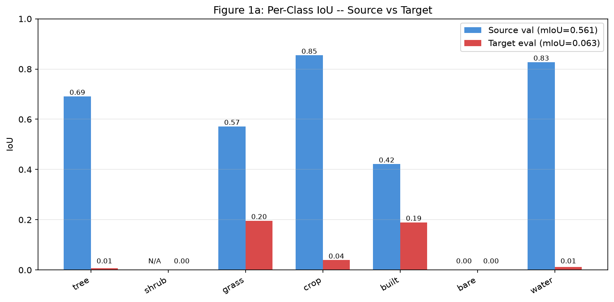
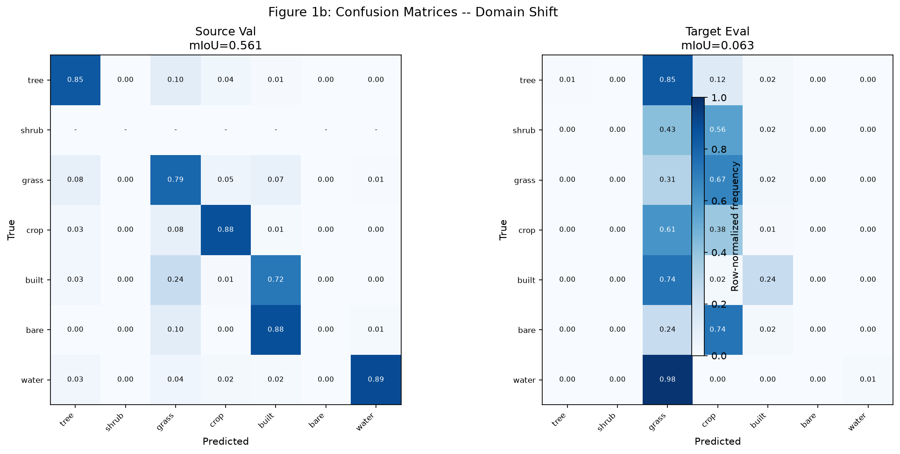
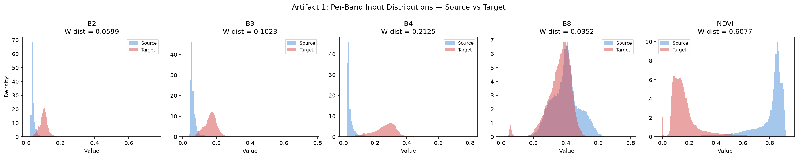
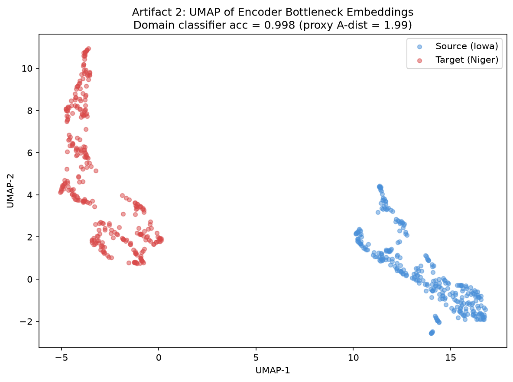
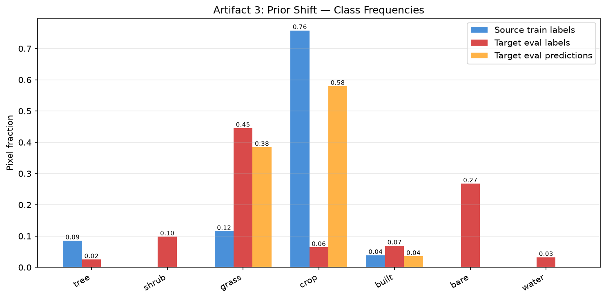
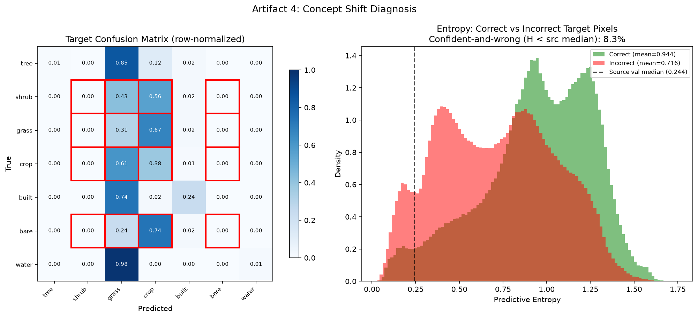
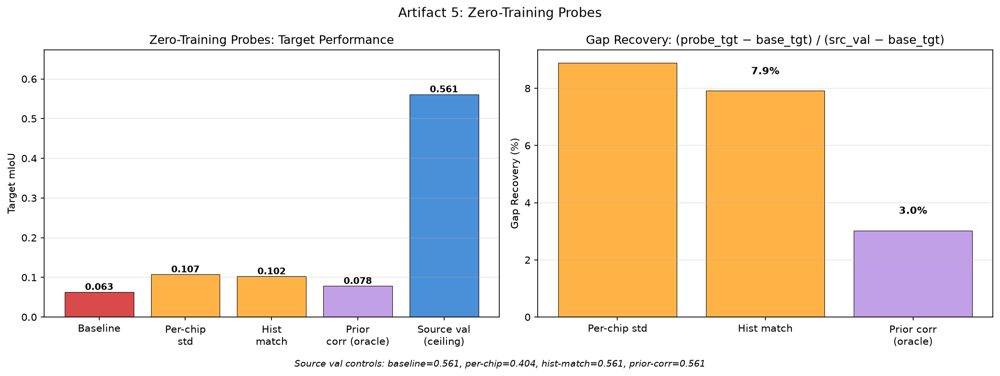
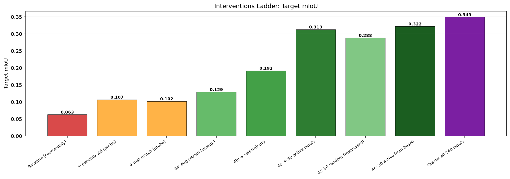

# Iowa to Sahel: Diagnosing and Fixing Land-Cover Segmentation Domain Shift

## 1. Problem Framing

I trained a land-cover segmentation model on Sentinel-2 imagery from Iowa and tested it on chips from the Sahel (Niger). Same sensor, different season and geography. The model goes from 0.56 mIoU on Iowa to 0.06 on Niger — basically useless.

Since it's the same sensor, we can rule out differences in calibration, resolution, or band definitions. What's left falls into three buckets:

| Hypothesis | What's going on | How to fix it |
|---|---|---|
| H1 — Covariate shift | Inputs look different: bright soils, sparse vegetation, different textures and field patterns | Augmentation, self-training, better encoder |
| H2 — Prior shift | Class frequencies are totally different (Iowa is 74% crop; Niger is 47% grass, 28% bare) | Class-balanced pseudo-labels, prior correction |
| H3 — Concept shift | The same class label means different things — Sahel "cropland" is bare soil most of the year; shrub/grass/bare blur together in ways Iowa labels never had to deal with | Only target labels can fix this |

A drop this large (50 pts) is too big to be just radiometric differences. I expected all three hypotheses to play a role.

**How this relates to the assignment.** The brief describes a 0.85→0.41 drop (44 pts). My stand-in dataset shows a larger shift: 0.56→0.06 (50 pts). The Iowa model is probably weaker because I'm using WorldCover labels (~75% accurate) instead of real ground truth, and only 255 training chips. The diagnostic conclusions (which hypotheses dominate) should still hold at the milder shift, though the probe recoveries (like histogram matching at 8%) might be higher when the baseline is already at 0.41. Over shared classes only, the drop is 48.7 pts — shrub is absent from Iowa, so the full 7-class mIoU includes a class the model can't possibly learn.

## 2. Reproduction

I used a U-Net with ResNet-34 encoder (ImageNet pretrained, 24.4M params), 5-channel input (B2, B3, B4, B8, NDVI), 7 classes. Trained on 255 Iowa chips with a spatial block val split of 45 chips, 30 epochs, AdamW lr=3e-4, cosine annealing, class-weighted CE loss.

| Domain | mIoU | tree | shrub | grass | crop | built | bare | water |
|--------|------|------|-------|-------|------|-------|------|-------|
| Source val (6 classes) | **0.561** | 0.69 | N/A | 0.57 | 0.85 | 0.42 | 0.00 | 0.83 |
| Target eval (7 classes) | **0.063** | 0.01 | 0.00 | 0.20 | 0.04 | 0.19 | 0.00 | 0.01 |
| Drop | **49.8 pts** | | | | | | | |

Note: source mIoU averages over 6 present classes (shrub is absent from Iowa). Target averages over all 7. Over the 6 shared classes only, the drop is 48.7 pts.

The confusion matrix tells the story — on Niger, the model predicts almost everything as grass or crop: tree→grass (85%), shrub→grass+crop (99%), bare→crop (74%), water→grass (98%). It's just mapping everything to the classes it learned in Iowa.

## 3. Diagnosis

I built five diagnostic artifacts, each targeting one of the three hypotheses.

### Artifact 1: Input Shift (H1)

Per-band Wasserstein distances: B2=0.060, B3=0.102, B4=0.213, B8=0.035, NDVI=0.608. NDVI is by far the most shifted — Iowa peaks near 0.8 (lush vegetation) while Niger spreads across 0.1-0.5 (sparse, post-rains). B3 and B4 are also shifted because Niger soils are much brighter.

### Artifact 2: Feature Shift (H1)

A logistic regression domain classifier on the encoder's bottleneck embeddings gets 99.8% accuracy (proxy A-distance = 1.99). The UMAP shows total separation — no overlap between domains at all. This isn't surprising given how different the inputs are, but it confirms the encoder learned domain-specific features rather than domain-invariant ones.

### Artifact 3: Prior Shift (H2)

Iowa training data is 74% crop with almost no shrub or bare. Niger is 47% grass, 28% bare, 10% shrub — completely different class balance. The model's predictions on Niger are biased toward grass and crop because those are the only classes it learned well. Shrub doesn't exist in Iowa at all, so the model can't predict it — that's label shift by construction.

### Artifact 4: Concept Shift (H3)

The crop/grass/shrub/bare block in the target confusion matrix (red border) shows heavy confusion. These four classes get mixed up systematically.

The entropy analysis turned up something interesting: incorrect target pixels have *lower* mean entropy (0.716) than correct ones (0.944). The model is actually more confident when it's wrong. Using the source val median entropy (0.244) as a threshold, about 8.3% of incorrect target pixels are below it. This pattern is consistent with concept shift — the model applies Iowa-learned features confidently to Sahel land cover and gets wrong answers. That said, neural nets are generally overconfident on out-of-distribution data, so this alone doesn't prove H3 over H1.

### Artifact 5: Zero-Training Probes

I tried three zero-training probes to see how much of the gap each hypothesis explains. Gap recovery = (probe_tgt - base_tgt) / (src_val - base_tgt).

| Probe | Target mIoU | Source Val mIoU | Gap Recovery |
|-------|-------------|-----------------|--------------|
| Baseline | 0.063 | 0.561 | — |
| Per-chip standardization | 0.107 | 0.404 | +8.9% |
| Histogram matching (quantile) | 0.102 | 0.561 | +7.9% |
| Prior correction (oracle) | 0.078 | 0.561 | +3.0% |

Per-chip standardization recovers 8.9% but kills source performance (0.561→0.404) — the model relies on absolute radiometric values and z-scoring breaks that. Not usable. Histogram matching gets +7.9% without hurting source, but it's still small. Simple radiometric fixes don't explain this drop. The bulk of H1 is in texture, spatial patterns, and cross-band relationships that histogram matching can't touch.

Oracle prior correction (rescaling softmax by target/source class ratios, skipping classes absent from source) recovers only 3.0%. It pushes grass from 0.20 to 0.45 — the model's grass features are decent, just suppressed by the Iowa prior — but tree, water, and built all collapse because the correction shifts probability mass away from them. Prior correction can't help when the features themselves are wrong, and even where features are OK, fixing one class breaks others. H2 is real (the class mix is totally different) but it can't be addressed by post-hoc reweighting alone.

### Hypothesis Weights

These are rough estimates based on the probe results, not a formal decomposition:

- H1 (covariate shift): ~50-60%. The inputs are very different and the encoder fully separates the domains. But simple radiometric fixes recover <10% — the real H1 problem is texture and spatial patterns, which need learned adaptation.
- H2 (prior shift): ~15-20%. Class frequencies are inverted, but the prior correction probe only recovers 3%. The class mix matters, but you can't fix it without fixing the features first.
- H3 (concept shift): ~25-30%. Sahel cropland is bare soil most of the year, and shrub/grass/bare blur together. The confident-wrong entropy pattern is consistent with this. Only target labels can fix it.

Going forward: if histogram matching had recovered >50% of the gap, I'd ship normalization + augmentation and stop. At 8%, labels are clearly needed.

## 4. Interventions

I tried a ladder of progressively stronger interventions, each building on the previous one. All evaluated on the same 60 target eval chips (which use WorldCover labels for evaluation only, never for training or selection).

| Method | Source mIoU | Target mIoU | Delta |
|--------|-------------|-------------|-------|
| Baseline (source-only) | 0.561 | 0.063 | -- |
| + per-chip std (probe) | 0.404 | 0.107 | +4.4 pts |
| + hist match (probe) | 0.561 | 0.102 | +3.9 pts |
| 4a: aug retrain (unsup.) | 0.520 | 0.129 | +6.6 pts |
| 4b: + self-training | 0.522 | 0.192 | +12.9 pts |
| 4c: + 30 active labels | 0.527 | 0.313 | +25.0 pts |
| 4c: 30 random (mean±std, 3 seeds) | 0.530 | 0.288±0.002 | +22.5 pts |
| 4c: 30 active from baseline | 0.515 | 0.322 | +25.9 pts |
| Oracle: all 240 labels | 0.522 | 0.349 | +28.6 pts |

One thing to note: every intervention costs about 3-5 pts on Iowa (0.561→~0.52). It's a small trade-off for 25+ pts on target, but worth knowing if you're deploying to both regions.

**4a — Photometric augmentation (+6.6 pts).** I used brightness/contrast/gamma jitter calibrated to the Wasserstein distances from Phase 3, plus histogram matching to random target chips as an augmentation. This is unsupervised — it uses target imagery but not labels. The gain is modest, which matches the Phase 3 finding that radiometric alignment alone can't close the gap.

**4b — Self-training (+12.9 pts).** Mean teacher with EMA (α=0.99) and per-class confidence thresholds. The starting teacher only has 6.3% mIoU on Niger, so most pseudo-labels are wrong. The model confidently calls sand "crop," those pixels pass thresholds, and the error gets reinforced. Shrub never gets any pseudo-labels because the teacher never predicts it — self-training can't learn classes that aren't in the source domain.

Both teacher and student see the same geo-augmented target images in this implementation. The source branch uses photometric augmentation, but there's no teacher-student asymmetry on the target side. That probably limits the self-training gains — standard mean-teacher works better when the student gets a stronger augmentation than the teacher.

Still, self-training picks up +12.9 pts, so it's doing some useful covariate adaptation despite the noisy supervision.

**4c — 30 actively labeled chips (+25.0 pts).** The big jump. I selected 30 chips using entropy + k-means diversity from the 4b teacher's embeddings, then fine-tuned the 4b model on source + those 30 chips (oversampled 8x). With just 30 labeled chips (12.5% of the pool), the model gets to 90% of the oracle ceiling.

**Active vs random.** Active gets 0.313, random averages 0.288±0.002 across 3 seeds. That's a 2.5 pt gap, about 12x the seed std. But ±0.002 only captures chip-selection variance, not the uncertainty from having just 60 eval chips. Active was only run once so I don't know its training noise. I'd need bootstrap CIs over the eval set to make this comparison properly conclusive.

**4c from baseline (+25.9 pts).** The most interesting result. Same 30 active chips but fine-tuned directly from the baseline, skipping 4a and 4b. It scored 0.322 — same or better than the full ladder (0.313). The ladder doesn't compound once you have labels. One caveat: the chips were selected using the 4b teacher, so 4b still contributed indirectly through better chip selection. Whether baseline-selected chips would do as well is untested.

**Oracle (+28.6 pts).** Fine-tuning on all 240 target labels gives the ceiling at 0.349, recovering 57% of the gap. The per-class numbers show where the limits are:

| Class | Oracle IoU | Note |
|-------|-----------|------|
| grass | 0.57 | Transfers OK |
| built | 0.55 | Transfers OK |
| water | 0.72 | Transfers OK |
| bare | 0.31 | Partly learnable |
| tree | 0.15 | Sahel trees look nothing like Iowa trees |
| crop | 0.08 | Very poor under this setup |
| shrub | 0.06 | Almost absent from source, ambiguous in target |

Under this setup (Iowa class weights, checkpoint picked on Iowa val), crop reaches only 0.08 IoU even with all 240 labels. Better checkpoint selection or rebalanced weights might improve this, but the core problem remains: Sahel millet on sandy soil looks the same as bare ground in a single-season optical composite.

## 5. The Bet

**My recommendation: label 30 actively selected target chips and fine-tune from the baseline.** It's the simplest thing that captures most of the gain (0.322 mIoU, +25.9 pts, 52% gap recovery).

The full ladder (augmentation → self-training → active labels) doesn't compound. Once you have labels, just fine-tune directly. The ladder is only worth it if you truly can't get any target labels at all.

**If labeling isn't possible,** the best unsupervised option is self-training at 0.192 (+12.9 pts). The brief provides unlabeled target chips, so proposing a labeling step goes beyond the given resources. But 30 chips is a small ask — maybe two hours of annotation — and the payoff is large.

I used 60 labeled target chips for evaluation. This is standard practice (you need to measure performance somehow) but worth stating: those labels are for scoring only, never used in training or selection.

One thing I didn't test: whether chips selected by the baseline (instead of the 4b teacher) would work just as well. In production I'd either run self-training just for chip selection (cheap, just inference) or fall back to a simpler diversity-only criterion.

**Decision rule for a new domain:**
1. Run the histogram matching probe. If it recovers >50% of the gap, ship normalization + augmentation.
2. If <50% (here it was 8%), get 30 actively labeled target chips and fine-tune. That's the sweet spot.
3. Self-training is worth trying as a warm-up for chip selection, but not as a replacement for labels.

**What's still broken.** The oracle ceiling at 0.349 leaves 43% of the gap unfixed. Crop, tree, and shrub are very hard to learn under the current setup. This is mostly a taxonomy and input problem:
- Sahel "cropland" is bare soil most of the year — a single post-rains composite can't tell it apart from actual bare ground.
- Shrub/grass/bare form a continuum that doesn't map to the 7-class WorldCover categories.

## 6. With More Time

Things I'd try with a week:

1. **Add SWIR bands (B11, B12).** Standard way to separate bare soil from dry vegetation and sparse crop — exactly the confusion block that limits the oracle. Prithvi also expects SWIR.
2. **Foundation-model encoder.** Swap ResNet-34 for Prithvi-100M or Clay. Trained on global Sentinel-2 data, should have better priors for semi-arid regions.
3. **Multi-season composites.** A single post-rains image can't distinguish Sahel crop from bare. Stacking wet + dry season composites would capture the phenological signal. Probably the single most impactful change.
4. **Redesign the label taxonomy.** The 7-class WorldCover scheme doesn't work for the Sahel. Merging shrub/grass/bare into "rangeland" or splitting crop into "irrigated" vs "rainfed" would match reality better. Needs local expertise.
5. **Get real ground truth.** WorldCover is a model (~75% accuracy, weaker in the Sahel). Even 20 field-validated chips would be more trustworthy than 60 WorldCover-labeled ones.
6. **Statistical rigor.** Bootstrap CIs over the 60 eval chips for every row, multiple training seeds. The current numbers are single-run point estimates.

## 7. Caveats

- WorldCover isn't ground truth — it's a model with ~75% global accuracy, weaker in the Sahel. Some of the "errors" might be label noise. The oracle ceiling at 0.349 partly reflects this.
- Sahel cropland is genuinely ambiguous. Sparse millet on sand vs actual bare ground — even a human would struggle from a single optical image.
- All interventions cost 3-5 pts on Iowa (0.561→~0.52). Fine for a target-focused deployment, but a mixed-region pipeline would need multi-task training.
- The target eval split is random (not spatial like the Iowa split). Neighboring chips can end up in both the training pool and the eval set, which may slightly inflate the labeled-target results.
- Most results are single runs (except 4c random with 3 seeds). Bootstrap CIs and multiple seeds would make the conclusions stronger.
- NDVI is clamped to [0, 1] at download, which discards the negative values water bodies produce. Minor, but worth noting.
- MPS (Apple Silicon) doesn't give fully reproducible results with the same seed.
